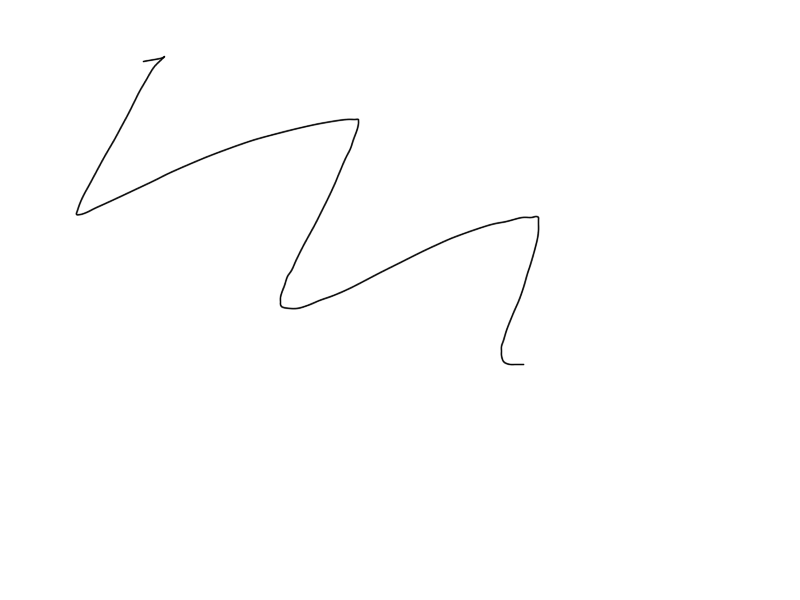

# Data Streaming Homework - Investigation of the Apache Kafka throughput

Goals:
- Learn about implementation of  dummy distributed application that uses kafka for communication between components
- Investigate throughput of a kafka-based solution considering different number of producers, consumers, partitions and replicas

Implementation:
- Single Zookeeper instance and three Kafka brokers
- Produced service
- Consumer service
- Reporting service

## How to Run the Implementation

### Set up

```
git clone https://github.com/conduktor/kafka-stack-docker-compose.git
cd kafka-stack-docker-compose
docker compose -f zk-single-kafka-multiple.yml up -d
```

### Usage notes

Start
```
docker compose build
docker compose up -d
```

...

Stop
```
docker compose down
```

### Clean-Up

```
docker compose down --rmi all -v --remove-orphans
docker compose -f zk-single-kafka-multiple.yml down --rmi all -v --remove-orphans
```

## Graphs of the throughput/max latency versus configuration
throughput/
1. One producer, a topic with one partition, one consumer
    
    

2. One producer, a topic with one partition, 2 consumers
    
    

3. One producer, a topic with 2 partitions, 2 consumers
    
    

4. One producer, a topic with 5 partitions, 5 consumers
    
    

5. One producer, a topic with 10 partitions, 1 consumers
    
    

6. One producer, a topic with 10 partitions, 5 consumers
    
    

7. One producer, a topic with 10 partitions, 10 consumers
    
    

8. 2 producers (input data should be split into 2 parts somehow), a topic with 10 partitions, 10 consumers
    
    

