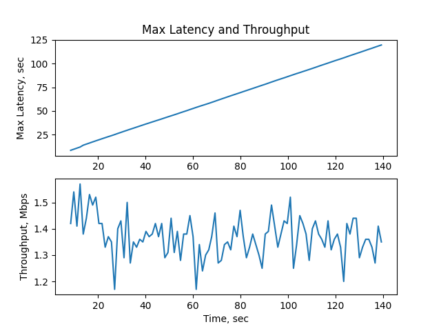
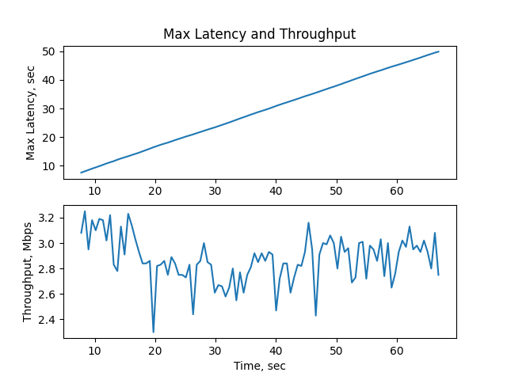
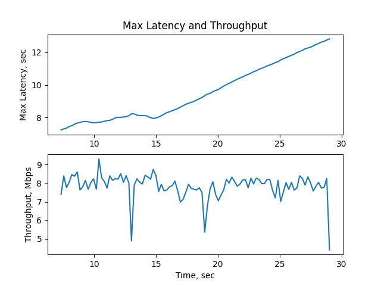
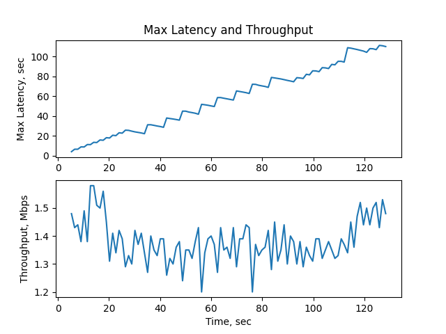
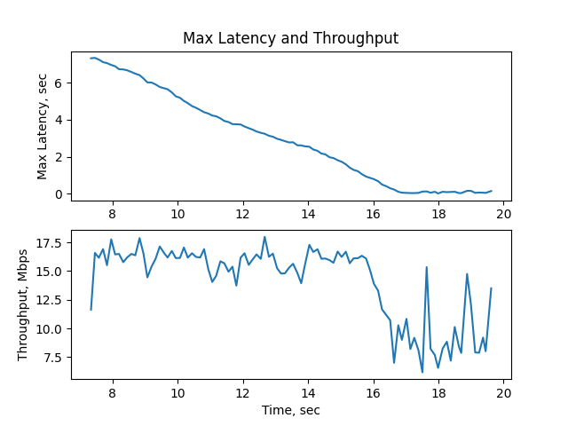
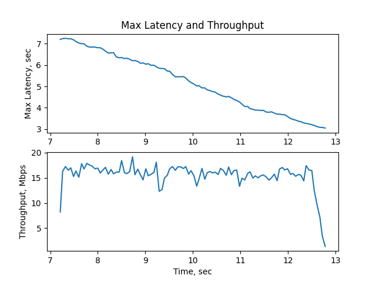

# Data Streaming Homework - Investigation of the Apache Kafka throughput

Goals:
- Learn about implementation of dummy distributed application that uses kafka for communication between components
- Investigate throughput of a kafka-based solution considering different number of producers, consumers, partitions and replicas

Implementation:
- Kafka environment
- Producer service
- Consumer service
- Reporting service

## Reddit Dataset

As dataset was used [1 million Reddit comments from 40 subreddits](https://www.kaggle.com/datasets/smagnan/1-million-reddit-comments-from-40-subreddits), from which the last two columns were removed by running the command `cut -d, -f1-2 kaggle_RC_2019-05.csv > reddit_ds.csv`.

And thus, the working dataset `reddit_ds.csv` contains the following columns:
- `subreddit (categorical)`: on which subreddit the comment was posted
- `body (str)`: comment content

## How to Run the Implementation

### Usage notes

Set up
```
git clone https://github.com/conduktor/kafka-stack-docker-compose.git
cd kafka-stack-docker-compose
docker compose -f full-stack.yml up -d
cd ..
git clone https://github.com/artemiuss/kafka_throughput_investigation.git
cd kafka_throughput_investigation
docker compose build
```

Run tests
```
./run_tests.sh
```

Stop and clean-up
```
docker compose down --rmi all -v --remove-orphans
cd ../kafka-stack-docker-compose
docker compose -f full-stack.yml down --rmi all -v --remove-orphans
```

## Graphs of the throughput/max latency versus configuration

1. One producer, a topic with one partition, one consumer
    
2. One producer, a topic with one partition, 2 consumers
    
3. One producer, a topic with 2 partitions, 2 consumers
    
4. One producer, a topic with 5 partitions, 5 consumers
    
5. One producer, a topic with 10 partitions, 1 consumers
    
6. One producer, a topic with 10 partitions, 5 consumers
    
7. One producer, a topic with 10 partitions, 10 consumers
    
8. 2 producers (input data should be split into 2 parts somehow), a topic with 10 partitions, 10 consumers
    

## Final Report


